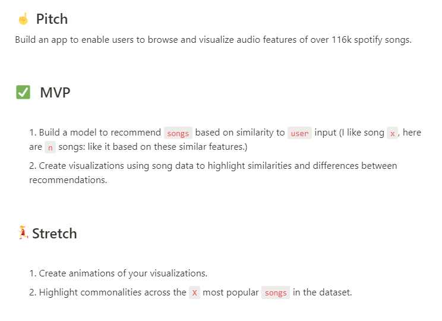

# Spotify Song Suggester

## Build an app to suggest songs to 

we are using the [Spotify Dataset 1921-2020](https://www.kaggle.com/yamaerenay/spotify-dataset-19212020-160k-tracks?select=data_by_genres.csv) which contains the audio features of 170,000+ songs released between 1921 and 2020. What's wrong with 2020...Don't get me started.

